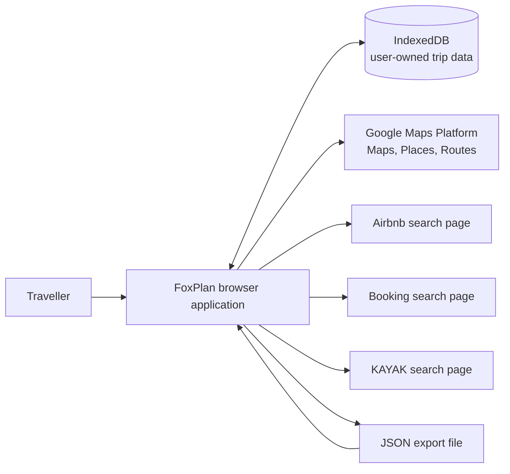
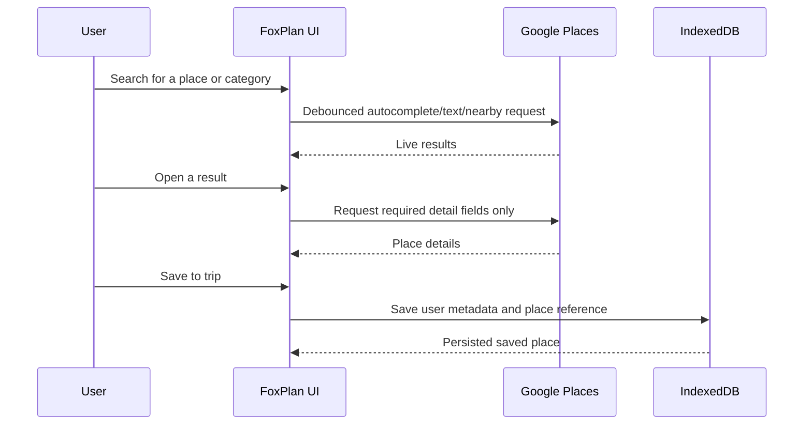
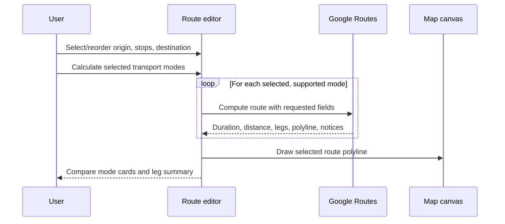

# FoxPlan Technical Design

**Status:** Proposed MVP architecture  
**Product:** FoxPlan  
**Primary language:** English  
**Initial UI locale:** French (`fr-FR`)  
**Initial currency:** Euro (`EUR`)

## 1. Purpose

FoxPlan is a map-first travel-planning web application. It brings trip planning information into one workspace so a traveller can evaluate a manually saved accommodation option alongside restaurants, activities, airports, and multi-stop routes.

The MVP is intentionally local-first:

- Trips and user-created planning data are stored in the current browser.
- Google Maps Platform provides the live map, place discovery, place details, and route calculations.
- Airbnb, Booking, and KAYAK are opened through outbound, provider-specific search links.
- Accommodation options are manually saved by the user after reviewing a provider's own website.

The application does **not** scrape, proxy, embed, or present live inventory from accommodation-provider websites.

## 2. Goals and non-goals

### 2.1 MVP goals

- Create and manage multiple independent trips.
- Plan by day using saved places and ordered itinerary stops.
- Search for destinations and points of interest on a Google map.
- Discover and save restaurants, activities, attractions, airports, transport locations, and accommodation context.
- Calculate and compare multi-stop routes across available transport modes.
- Compare the distance and travel time from an accommodation candidate to selected places and an airport.
- Create outbound accommodation searches for Airbnb, Booking, and KAYAK.
- Persist user-owned data locally with JSON export and import.
- Provide a responsive desktop-first dashboard, accessible keyboard controls, and an internationalization foundation.

### 2.2 Non-goals

The first release does not include:

- User accounts, authentication, collaboration, or cloud synchronization.
- Booking, payments, price alerts, or live availability.
- Scraping or embedded pages from Airbnb, Booking, KAYAK, or other providers.
- A provider-owned live accommodation result feed, preview, or price comparison.
- Street View, offline map tiles, or PWA offline support.
- Expense or budget tracking.

## 3. Architectural principles

1. **Map-first, not map-only.** The map, route editor, saved-place list, and details panel represent the same trip state.
2. **Local-first user data.** The browser remains the source of truth for trip plans until an explicit import or export occurs.
3. **Live third-party data.** Google data is fetched when needed and is not treated as the application's permanent database.
4. **Provider boundaries.** Accommodation providers are isolated behind adapters so authorised partner APIs can be added later without rewriting the dashboard.
5. **Cost-aware integration.** Searches and route requests are debounced, cancellable, explicit where possible, and scoped to an active trip.
6. **Replaceable persistence.** Application features depend on repositories/interfaces rather than directly on IndexedDB, allowing a future sync service.
7. **Privacy by default.** No user account, secret, or third-party credentials are stored in the travel data.

## 4. Proposed technology stack

| Area | Proposed technology | Responsibility |
| --- | --- | --- |
| Application | React + TypeScript | Component UI and domain composition |
| Build tooling | Vite | Development server and production build |
| Styling | CSS modules or a lightweight token-based CSS layer | Dark-first dashboard layout, responsive styles, theme tokens, and accessibility states |
| State | Feature-local React state plus a small application store | Active trip, selected place, filters, panels, transient API state |
| Persistence | IndexedDB through a typed repository layer | Local trips and user-owned planning data |
| Validation | Runtime schema validation library | Import validation, migration validation, provider form validation |
| Maps | Google Maps JavaScript API | Interactive map, markers, map controls, required attribution |
| Places | Google Places API / Maps JavaScript Places library | Autocomplete, search, details, photos where permitted |
| Routing | Google Routes API or Maps JavaScript Routes capabilities | Multi-stop route distance, duration, legs, transport-mode comparison |
| Testing | Unit-test runner, React component tests, browser E2E tests | Domain, UI, adapter, and workflow verification |

The final dependency selection must be recorded in [README.md](../README.md) when the application is scaffolded.

## 5. System context



### 5.1 Trust boundaries

| Boundary | Data crossing it | Rule |
| --- | --- | --- |
| Browser ↔ IndexedDB | User-created trips, notes, saved identifiers, candidates | Validate schemas before reads/imports and keep migrations versioned. |
| Browser ↔ Google Maps Platform | Search terms, place IDs, coordinates, route requests | Restrict the browser API key by HTTP referrer; enable only required APIs; follow Google Maps Platform terms and attribution requirements. |
| Browser → accommodation provider | Encoded destination and available search criteria | Open a new provider tab; do not fetch or parse provider result pages. |
| Browser ↔ JSON file | Exported/imported user-owned planning data | Never include API keys, transient Google responses, or untrusted executable content. |

## 6. Application architecture

The application is divided by feature rather than by technical layer alone. Features own their UI, domain actions, and adapters; shared code contains stable cross-feature abstractions.

```text
src/
  app/                  # application shell, router, providers, startup
  features/
    trips/              # trip lifecycle and active-trip selection
    itinerary/          # day plans and ordered route stops
    map/                # map lifecycle, markers, viewport, overlays
    places/             # search, details, saved places, map filters
    routes/             # route editor, transport comparisons, route rendering
    accommodation/      # provider URL adapters and saved candidates
    import-export/      # JSON export/import workflows
    localization/       # translation catalogue and locale formatting
  domain/               # shared entities, schemas, use cases, repository ports
  infrastructure/
    persistence/        # IndexedDB repositories and migrations
    google/             # Maps, Places, and Routes gateway implementations
  shared/
    ui/                 # accessible primitives and design tokens
    lib/                # pure utilities such as distance calculation
  test/                 # fixtures, mocks, and test setup
```

### 6.1 Dashboard composition

The main view has three synchronized regions:

1. **Trip navigation:** creates and selects trips; presents trip dates and local-storage status.
2. **Map canvas:** renders live Google map data, category markers, a selected place, saved candidates, and the selected route.
3. **Context panel:** switches between search results, place details, saved places, itinerary editor, route comparison, and accommodation candidate details.

On narrow screens, the context panel becomes a bottom sheet or full-screen panel. The map is never instantiated more than once for the active dashboard.

### 6.2 Visual design and theme

FoxPlan uses a **dark theme by default**. The application shell must apply the dark theme before rendering the dashboard to avoid a light-theme flash on startup.

- Define semantic CSS tokens for surfaces, elevated panels, text, borders, focus rings, status colours, and map controls; components must consume tokens rather than fixed colours.
- Use a dark, high-contrast dashboard palette with visually distinct map controls, selected markers, route modes, and category filters.
- Meet WCAG 2.2 AA contrast requirements for text, controls, focus indicators, errors, and selected states in the default theme.
- Set the browser `color-scheme` to `dark` while the default theme is active so native controls match the application.
- Persist an explicit theme choice in `ApplicationSettings`. The initial value is `dark`; a future light or system option may be added without changing component styles.
- The Google map styling must be reviewed independently so its labels and controls remain legible against the dark application shell and preserve required Google branding.

## 7. Domain model

All persisted records require a stable `id`, an ISO 8601 `createdAt` timestamp, and an ISO 8601 `updatedAt` timestamp. The exact runtime schemas are the authoritative implementation contract.

### 7.1 Core entities

| Entity | Required data | Notes |
| --- | --- | --- |
| `Trip` | Name, destination, dates, locale, currency | Owns saved places, days, candidates, and preferences. |
| `TripDay` | Trip ID, date, display order | References saved places and optional route plans. |
| `SavedPlace` | Trip ID, Google Place ID or user coordinates, category, title snapshot, notes, tags | Persist the user decision and stable identifier, not a full long-lived Google response. |
| `AccommodationCandidate` | Trip ID, provider, source URL, name, location, notes | Price, image, and constraints are optional manual entries. |
| `RoutePlan` | Trip ID, optional day ID, ordered stops, selected mode | Stores route intent, not route API responses. |
| `RouteStop` | Route plan ID, position, source place/candidate/coordinate | `position` is explicit for deterministic ordering. |
| `MapPreferences` | Trip ID, viewport hint, visible categories | Preferences are local and scoped to a trip. |
| `ApplicationSettings` | Optional Google Maps browser API key, setup status, theme preference | Stored locally but is never part of a trip or data export. The default theme is `dark`. |

### 7.2 Recommended TypeScript shape

```ts
type GeoPoint = {
  lat: number;
  lng: number;
};

type PlaceReference = {
  placeId?: string;
  coordinates: GeoPoint;
  displayName: string;
};

type AccommodationCandidate = {
  id: string;
  tripId: string;
  provider: "airbnb" | "booking" | "kayak" | "other";
  sourceUrl: string;
  name: string;
  location: PlaceReference;
  price?: { amount: number; currency: string; period?: "night" | "stay" };
  imageUrl?: string;
  notes?: string;
  checkInNotes?: string;
  createdAt: string;
  updatedAt: string;
};
```

`displayName` and similar lightweight snapshots exist to keep user-created records understandable offline. A selected place's fresh operational information—such as rating, opening hours, photos, or reviews—must be obtained from Google when needed and displayed according to the applicable terms.

### 7.3 Storage schema and migrations

Use an application envelope to support future migrations:

```json
{
  "schemaVersion": 1,
  "exportedAt": "2026-07-17T12:00:00.000Z",
  "trips": [],
  "savedPlaces": [],
  "accommodationCandidates": [],
  "routePlans": []
}
```

Import processing must follow this order:

1. Parse JSON without evaluating any content.
2. Check the envelope and schema version.
3. Validate each entity and all relationships.
4. Migrate known older versions into the current in-memory format.
5. Show an import summary and request a merge or replace decision.
6. Write in a single IndexedDB transaction where possible.
7. Keep the current data untouched if validation or migration fails.

## 8. Local persistence and data lifecycle

### 8.1 IndexedDB responsibilities

IndexedDB stores only user-owned planning data:

- Trips, day assignments, saved-place references, notes, tags, and route-stop order.
- Manually created accommodation candidates and their user-provided metadata.
- Per-trip map/filter preferences and the active-trip reference.
- Last-used provider search form values, provided they are not sensitive.
- The Google Maps browser API key entered through the Settings screen, in a separate application-settings store only.

### 8.2 Data that must not be stored as the application database

Avoid persisting the following beyond any period permitted by the relevant service terms:

- Google map tiles and map imagery.
- Complete Google Places search/detail responses, photos, reviews, or ratings as a local catalogue.
- Google route responses, polylines, traffic information, or derived long-lived route cache.
- Browser API keys in exported files, trip records, logs, analytics events, or error reports.
- Accommodation-provider page HTML, images, search result data, live availability, or live prices.

Routes are recalculated after an intentional user action or a route-stop change. Place details are refreshed when a user opens the relevant detail panel.

### 8.3 Export and import

Export includes only the entities described in the local data model. It excludes secrets and live third-party API payloads. Import must provide clear errors for malformed files, unknown schema versions, duplicate IDs, invalid coordinates, and invalid dates.

The user must be told that clearing browser storage, using another browser, or changing device can remove local data unless they have exported it.

## 9. Google Maps Platform integration

### 9.1 Required capabilities

| Capability | Expected use in FoxPlan |
| --- | --- |
| Maps JavaScript API | Interactive map, viewport, markers, clustering, route overlays, Google branding/attribution |
| Places | Destination autocomplete, text/category/nearby search, place details, photos when available and permitted |
| Routes | Multi-stop route calculation, legs, distance, duration, supported transport modes, optional traffic/toll information |

The actual Google Cloud APIs enabled must match the final client integration and current Google documentation. This document does not replace Google Maps Platform terms, quota rules, data-retention rules, or attribution rules.

### 9.2 API-key handling

The Maps JavaScript API uses a browser-visible key. It is not a secret, but it must be protected by referrer and API restrictions. FoxPlan must let the traveller configure this key through the interface, because the project is a browser-only application.

#### Runtime Settings screen

The application shell provides a **Settings → Google Maps** screen and an initial onboarding prompt when no valid key is available. It includes:

- A labelled, masked text input for the Google Maps browser API key.
- A link to Google Cloud instructions for creating and restricting the key.
- A concise warning that Google Maps usage can incur charges in the user's Google Cloud project.
- A **Save and initialize map** action that validates only basic client-side shape, stores the key locally, and loads the map SDK.
- A non-sensitive status indicator: not configured, loading, ready, or configuration error.
- A **Replace key** action and a **Remove key** action. Removing it unloads/disables map-dependent features and retains all local trip-planning data.

The application must never show the full saved key after storage. It may reveal a short, non-sensitive suffix for confirmation. When a key changes, the user is told that the map will reload before it becomes active.

#### Key source and precedence

1. A key entered in Settings is the primary runtime source. Store it in the dedicated IndexedDB application-settings record, never inside a trip.
2. An optional `VITE_GOOGLE_MAPS_API_KEY` value may serve as a developer or managed-deployment fallback when no local runtime key has been entered.
3. The settings key is local to the current browser profile. It is excluded from JSON export/import and does not synchronize to another device.
4. Do not commit a key; provide an `.env.example` with the fallback variable name only.

#### Required key protection

1. Restrict the key to approved HTTP referrers for development, preview, and production domains.
2. Restrict the key to the minimum required Google APIs.
3. Enable billing budgets, alerts, quota monitoring, and key-usage monitoring in Google Cloud.
4. Rotate or revoke a compromised key immediately.

Any future provider affiliate credentials or privileged Google credentials must be used only by a protected server-side component, never by this browser application.

### 9.3 Place workflow



Request only the fields needed for the active view. This reduces latency, data handling, and billed usage.

### 9.4 Route workflow



The route editor stores the ordered stop references. It does not persist raw route responses. If a mode is unavailable for a region or request, the UI presents that state instead of attempting to estimate a result.

### 9.5 Cost controls

- Debounce text entry and cancel stale search requests.
- Fetch place details only after explicit selection.
- Request only required response fields.
- Require an explicit calculation action for multi-mode route comparison.
- Enforce a practical client-side limit on stops and simultaneous mode calculations.
- Display graceful quota and network failures.
- Monitor Google Cloud billing and quotas outside the app.

## 10. Proximity analysis

FoxPlan provides two clearly differentiated measurements:

| Measurement | Calculation | Use |
| --- | --- | --- |
| Straight-line distance | Local great-circle/Haversine calculation using coordinates | Fast comparison of nearby options with no API call |
| Route distance and duration | Google Routes request for selected transport mode | Travel-time comparison and itinerary decisions |

The interface must always label the measurement type. Straight-line distance is not travel distance, and it must not be displayed as a driving, walking, or transit estimate.

## 11. Accommodation-provider workflow

### 11.1 Provider adapter contract

Each provider adapter accepts a normalized search query and produces an outbound URL. It does not fetch provider content.

```ts
type AccommodationSearchQuery = {
  destination: string;
  checkIn?: string;
  checkOut?: string;
  adults?: number;
  children?: number;
  rooms?: number;
  budget?: { min?: number; max?: number; currency: string };
};

interface AccommodationProviderAdapter {
  provider: "airbnb" | "booking" | "kayak";
  buildSearchUrl(query: AccommodationSearchQuery): URL;
}
```

Not every provider supports every query parameter in a stable public URL. Each adapter must encode only supported criteria and must be covered by tests. The UI should explain when a provider will require the traveller to complete a criterion on its own site.

### 11.2 User journey

1. The traveller chooses a destination, dates, guests, and provider in FoxPlan.
2. FoxPlan validates the form and opens the provider search in a new tab.
3. The traveller reviews live availability, price, images, rules, and booking conditions on the provider website.
4. The traveller manually saves a preferred option in FoxPlan with the provider URL and a map location.
5. FoxPlan compares that candidate against saved places, selected activities, and an airport.

### 11.3 Future authorised integrations

Live provider data can only be considered after obtaining an authorised partner or affiliate integration for each provider. Such an extension requires:

- A backend that holds provider credentials and applies server-side authorization.
- Provider-specific legal review, rate-limit handling, terms compliance, and disclosure requirements.
- A cache/retention design that follows the provider's contract.
- A replacement implementation behind the existing provider-adapter interface.

It is explicitly outside this browser-only MVP.

## 12. User interface and accessibility

### 12.1 Interaction rules

- A selected marker, search result, and detail panel always identify the same place.
- Map filters change both visual markers and list content.
- Saving a place is an explicit action and provides confirmation.
- Destructive trip and import-replace actions require confirmation.
- Route results retain a visible calculation timestamp and are marked as live/transient.
- External provider links open in a new tab and clearly identify the destination provider.

### 12.2 Accessibility requirements

- All controls are reachable and usable with a keyboard.
- Map actions have non-map panel alternatives for discovery, selection, and saving.
- Marker selection exposes an accessible name and equivalent detail action.
- Panels manage focus correctly when opened, closed, or transformed into mobile sheets.
- Colour is never the only indicator of category, transport mode, or selection.
- Loading, empty, validation, and API-error states are announced accessibly.

## 13. Internationalization

The MVP ships with `fr-FR` as the default locale and `EUR` as the default currency. UI strings must be externalized from the first implementation.

- Use locale-aware APIs for date, number, duration, distance, and currency formatting.
- Store canonical values such as ISO dates, metre/kilometre base quantities, and ISO 4217 currency codes.
- Keep translated labels separate from domain enum values.
- Do not assume that the trip locale is identical to the browser locale.

## 14. Error handling and resilience

| Failure | Required behaviour |
| --- | --- |
| Missing/invalid Maps key | Show a configuration error without crashing the rest of the dashboard. |
| Google quota/network failure | Preserve user plan data; provide retry and concise diagnostic information. |
| Unsupported route mode | Show mode as unavailable; do not fabricate duration or distance. |
| Stale place request | Cancel or ignore it when the query/selection changes. |
| IndexedDB unavailable/quota exceeded | Explain that local saving failed and offer export where possible. |
| Invalid import | Do not alter existing data; report the failing validation area. |
| Invalid provider URL/query | Block the action and explain the required correction. |

## 15. Security and privacy

- Treat all imported JSON and user-entered URLs as untrusted input.
- Validate URLs before rendering links; permit only safe `https:` external links for provider candidates.
- Escape user-entered text through standard React rendering; do not inject HTML from notes or imported fields.
- Never expose privileged credentials in browser code, exports, logs, or screenshots.
- Treat the runtime Maps key as locally stored configuration, not as a secret: mask it in the UI and exclude it from exports, telemetry, diagnostics, and trip data, while relying on Google Cloud restrictions for protection.
- Avoid analytics containing exact addresses, trip details, or query strings unless the user has clearly consented.
- Tell users their data is stored in the current browser and can be removed by browser-data clearing.
- Follow current Google Maps Platform terms, especially branding, attribution, caching, and data-retention requirements.

## 16. Quality strategy

### 16.1 Automated tests

| Test level | Coverage |
| --- | --- |
| Unit | Schemas, migrations, Haversine distance, route comparison, locale formatting, provider URL builders |
| Component | Dashboard panel states, dark-theme token usage and contrast, map filters, route editor, forms, import errors, API-key settings, accessible interactions |
| Integration | Repository operations, import transactions, runtime key precedence, Google gateway mocks, saved-place and candidate workflows |
| Browser E2E | First-run dark theme, first-run API-key onboarding, key replacement/removal, multi-trip persistence, route-stop reorder, provider link opening, export/import, responsive dashboard flow |
| Build checks | Type checking, linting, formatting, production build |

Google gateways must be mocked in automated tests. A manually controlled smoke test against real APIs is still required before release, using a restricted key and a monitored billing project.

### 16.2 MVP acceptance scenarios

1. Create two trips, switch between them, reload, and verify their data remains separate.
2. Search a destination, find restaurants and activities, save places, and verify map/list/filter synchronization.
3. Assign saved places to a day and build a multi-stop route.
4. Compare supported modes and verify total and per-leg duration/distance presentation.
5. Save an accommodation candidate and compare it to an airport and nearby saved locations using both measurement types.
6. Open all three provider searches and verify the application neither fetches nor embeds provider result pages.
7. Enter a restricted Google Maps key through Settings, confirm the map initializes, replace/remove it, and verify trip data is retained while the key is absent from exports.
8. Open the application in a fresh browser profile and verify the dark theme is rendered before the dashboard; verify all default-theme text and controls meet their contrast requirements.
9. Export data, alter local records, import the file, and verify validation plus restoration behaviour.

## 17. Delivery phases

| Phase | Deliverable | Dependencies |
| --- | --- | --- |
| 1. Foundation | React/Vite setup, dashboard shell, environment template, quality tooling | None |
| 2. Local domain | Schemas, repositories, migrations, trip lifecycle, import/export | Phase 1 |
| 3. Discovery | Map, Places search/details, saved places, filters, proximity | Phases 1–2 |
| 4. Itinerary | Day planning, ordered route editor, route comparisons, route overlay | Phases 2–3 |
| 5. Accommodation | Provider adapters, outbound forms, saved candidates, comparison | Phases 2–3 |
| 6. Release hardening | Localization pass, resilience, accessibility, tests, documentation | All previous phases |

Discovery and accommodation work may run in parallel once the shared domain entities are stable. Routing follows the saved-place and Google integration foundations.

## 18. Deployment and operations

The MVP is a static frontend build. It can be hosted on any HTTPS static hosting service.

Before deployment:

1. Configure separate Google Maps keys or referrer rules for development, preview, and production.
2. Add the production hostname to permitted referrers.
3. Optionally configure the public build-time map-key fallback in the hosting platform for managed deployments; this is not required when users configure their own key in Settings.
4. Verify that no `.env` file or key is committed, and that the runtime Settings key is never included in export files or telemetry.
5. Set Google Cloud billing alerts and quotas.
6. Run the automated quality suite and manual real-API smoke scenarios.
7. Verify provider links and privacy/local-data notices in production.

## 19. Future evolution

The following can be introduced later without changing the MVP's core planning model:

- A cloud repository adapter with authentication and encrypted server-side storage.
- Opt-in multi-device synchronization and collaboration.
- Official provider/affiliate integrations through a protected backend.
- Budget tracking linked to manually entered candidate pricing.
- Calendar integrations, notifications, and trip sharing.
- Progressive-web-app support for application-shell offline access, subject to map-provider requirements.

Any future service integration must preserve the existing separation between user-owned data, live third-party data, and credentials.

## 20. References

- [Google Maps JavaScript API overview](https://developers.google.com/maps/documentation/javascript/overview)
- [Google Places API overview](https://developers.google.com/maps/documentation/places/web-service/overview)
- [Google Routes API overview](https://developers.google.com/maps/documentation/routes/overview)
- [Google Maps Platform pricing](https://mapsplatform.google.com/pricing/)
- [Google Maps Platform terms of service](https://cloud.google.com/maps-platform/terms)

These external documents are authoritative and must be reviewed again when implementation begins, because APIs, pricing, terms, quotas, and provider URL behaviour can change.